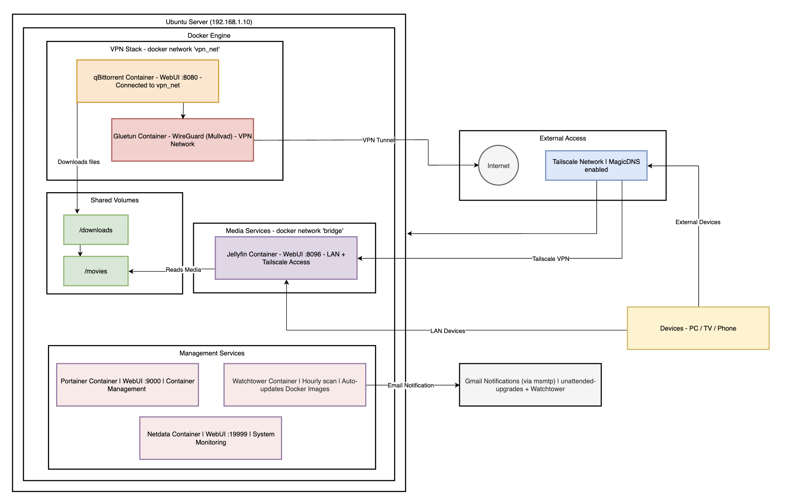

# Homelab: Ubuntu Server with Docker

## The idea

I had an old PC I built back in 2016 sitting unused. Rather than let it gather dust I decided to repurpose it as a home server. The goal was practical: learn Linux properly, get hands-on with Docker outside of a GUI, and run some useful services at home. It turned out to be one of the most useful things I've done for my technical development.

---

## Hardware

A self-built PC from 2016, repurposed as a headless Ubuntu Server. Running 24/7 on the home network at 192.168.1.10.

---

## What's running

| Container | Purpose | Port |
|-----------|---------|------|
| qBittorrent | Download client | 8080 |
| Gluetun | WireGuard VPN tunnel (Mullvad) | - |
| Jellyfin | Media server | 8096 |
| Pi-hole | Network DNS | 8091 / 53 |
| Tailscale | Remote access | - |
| Netdata | System monitoring | 19999 |
| Portainer | Container management UI | 9000 |

---

## Architecture

The setup is split into distinct network stacks, which was a deliberate decision to keep services isolated from each other.

The download client runs inside a dedicated Docker network called vpn_net, alongside the Gluetun container which handles the WireGuard VPN tunnel. Any traffic from the download client is forced through Gluetun before it reaches the internet. If the VPN drops, the traffic stops. This is sometimes called a kill switch pattern and it was one of the trickier parts of the setup to get right.

Jellyfin runs on the standard bridge network and reads media from a shared volume at /movies, which the download client writes to at /downloads. The two containers never talk directly to each other but share the filesystem, which keeps things clean.

Pi-hole sits in its own network stack handling DNS for the local network, blocking ads at the DNS level before they reach any device on the network.

Tailscale provides remote access, allowing me to connect back into the home network securely when away. In practice I use this to run updates and manage containers remotely, and to access Jellyfin when I'm not at home.

Netdata and Portainer sit on top of everything as management tools. Netdata gives real-time visibility into system health and resource usage. Portainer provides a web UI for managing all the containers without needing to SSH in every time.

---

## How it came together

The initial server setup and core containers took around five and a half hours. Getting the VPN routing working came about a week later and took another two hours on top of that.

I came into this having only used Docker through a GUI previously. Doing everything in Linux via the command line was a step up. The Gluetun container in particular took a lot of attempts to get right. Getting the networking configured so that the download client's traffic was actually routing through the VPN rather than around it wasn't obvious and required a fair bit of troubleshooting. AI helped me work through the configuration once I understood what I was actually trying to achieve.

---

## What hasn't worked yet

Two things are still unresolved and worth documenting honestly.

Pi-hole is set up and the web UI is accessible, but pointing my router to use it as the primary DNS server hasn't worked yet. The container is running fine, it's a router configuration problem I haven't solved. This is next on the list.

Duplicati was the first attempt at setting up automated backups to OneDrive. It failed at the initial login step as I couldn't get past the password setup for the web UI. I haven't gone back to fix this yet. Backup to OneDrive is still a planned piece of work.

---

## What I learned

Running Docker properly in Linux is meaningfully different from using it through a GUI. Writing and editing docker-compose files directly, understanding how container networking actually works, and debugging why a container won't start are all skills that don't translate from clicking around a UI.

The VPN routing setup gave me a real understanding of Docker network isolation. The whole point of vpn_net is that containers on it can only reach the outside world through Gluetun. If that container goes down, the others on that network lose internet access entirely. Understanding why that works requires understanding how Docker handles routing between networks, which is directly applicable to the AWS networking concepts I'm covering in the SAA course.

Tailscale is genuinely impressive for remote access. It uses a mesh VPN approach where devices connect directly to each other rather than through a central server. Setting it up took about ten minutes and it just works.

---

## What's next

- Fix the Pi-hole DNS configuration at the router level
- Find a working backup solution for OneDrive (Duplicati replacement or fix)
- Update the architecture diagram to include Netdata and Portainer
- Document the docker-compose files for each stack

---

## Skills this covers

Linux server administration, Docker, container networking, VPN configuration, DNS, remote access, system monitoring, and infrastructure troubleshooting. Most of these map directly onto the containerisation and networking topics coming up in the AWS portion of my learning.
