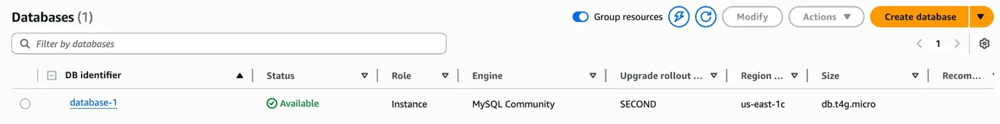
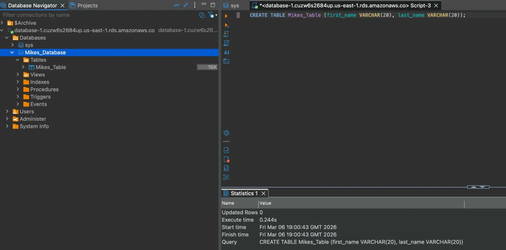
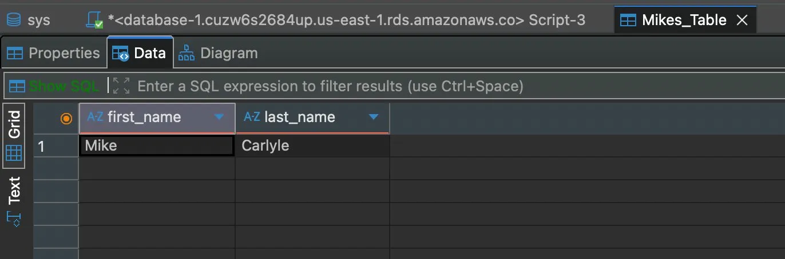
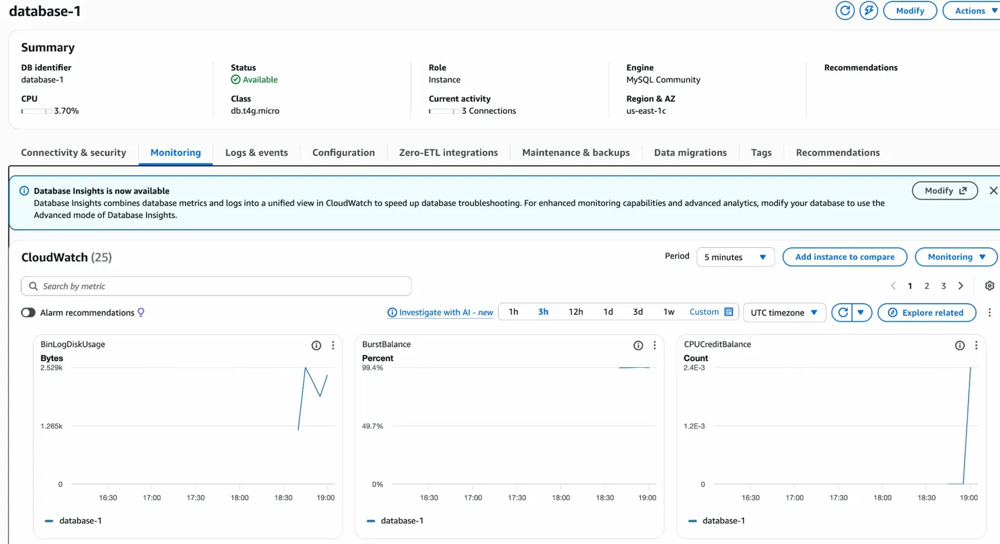
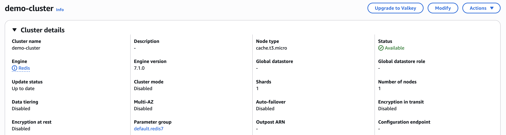

# Databases: RDS, Aurora, ElastiCache

## RDS: Relational Database Service

RDS is AWS's managed database service. Rather than running a database on an EC2 instance yourself, AWS handles the heavy lifting of keeping it running, patched, and backed up. It supports PostgreSQL, MySQL, MariaDB, Oracle, Microsoft SQL Server, IBM Db2, and Aurora.

### Why use RDS over running a database on EC2

The managed nature of RDS is the main reason. Things you get for free that you'd have to handle yourself on EC2:

- Automatic OS patching
- Continuous backups with point-in-time restore down to a specific timestamp
- Monitoring dashboards built in
- Read replicas for scaling reads
- Multi-AZ for disaster recovery
- Vertical and horizontal scaling options
- Automatic storage scaling for unpredictable loads

The one trade-off is that you cannot SSH into an RDS instance. It's a managed service so AWS controls the underlying infrastructure.

### Storage Auto Scaling

RDS can automatically scale storage when it detects you're running low. This removes the need to manually increase storage and is particularly useful for workloads where usage is hard to predict. You can set a maximum storage threshold to prevent it scaling beyond what you're willing to pay for.

---

## Read Replicas

Read replicas allow you to scale read performance by creating up to 15 copies of your database that handle read traffic. They can be within the same AZ, across AZs, or across regions entirely.

Replication uses an asynchronous method, meaning replicas will eventually be in sync with the primary but there's a window where they might serve slightly stale data if replication hasn't caught up yet. This is worth being aware of for any application where data freshness is critical.

Replicas can also be promoted to become their own standalone database if needed.

### A practical use case

A production database is handling normal application load fine. A reporting team then wants to run analytics queries against it. Running heavy analytics on the production database risks overloading it and impacting real users. The solution is to point the reporting application at a read replica instead, keeping the load off the primary database entirely.

### Cost

Data transfer between AZs in AWS normally incurs a cost. This does not apply to RDS replication within the same region, even across AZs, because it's a managed service. Cross-region replicas do incur a replication fee for the network traffic involved.

---

## Multi-AZ (Disaster Recovery)

Multi-AZ creates a standby copy of your database in a different AZ. Unlike read replicas, this uses synchronous replication, meaning the standby is always up to date. AWS provides a single DNS name for the database and automatically fails over to the standby if the primary goes down, with no manual intervention needed.

Important distinction: Multi-AZ is for availability and disaster recovery only. It is not used for scaling reads. The standby cannot serve traffic under normal circumstances.

### Moving from single to Multi-AZ

This can be done with zero downtime. You simply modify the database and enable Multi-AZ. Behind the scenes AWS takes a snapshot of the primary, restores it into the new AZ, and then establishes synchronisation between the two until they're in sync.

---

## RDS Custom

RDS Custom covers Oracle and Microsoft SQL Server specifically and gives you more control than standard RDS. You can configure settings, install patches, and enable native database features that standard RDS doesn't expose. To do this you deactivate automation mode, but this comes with risk. The course recommendation is to take a snapshot before making any changes so you have a safe restore point.

---

## Hands-on Lab

Created a MySQL RDS instance via the AWS console and set up a new security group with an inbound rule allowing access on port 3306.

Rather than SQLElectron as suggested in the course, I connected using DBeaver which I already had installed. The connection worked first time.

Once connected I created a new database called Mikes_Database, added a table called Mikes_Table with first_name and last_name columns, and inserted a row of data.

The RDS monitoring dashboard shows CloudWatch metrics updating in real time including CPU usage, BurstBalance, and BinLogDiskUsage, confirming the instance is active and being monitored automatically.

---

## What I took from this section

The distinction between read replicas and Multi-AZ is one of the most commonly tested concepts in the SAA exam. Read replicas are for performance and scaling reads. Multi-AZ is for availability and failover. They serve completely different purposes and can be used together.

The async vs sync replication difference matters in practice. Async means replicas might lag behind. Sync means the standby is always current but introduces a small write latency because AWS has to confirm both copies are written before acknowledging success.

The fact that you can't SSH into RDS is a reminder that managed services involve giving up some control in exchange for operational simplicity. For most use cases that's a good trade.

---

## Aurora

Aurora is AWS's own cloud-native relational database engine, compatible with both PostgreSQL and MySQL drivers. Because it was built specifically for the cloud rather than adapted from an existing engine, it hits 3-5x the performance of standard MySQL or PostgreSQL on RDS. That performance comes at a cost though, as Aurora runs around 20% more expensive than standard RDS.

### Storage

Storage starts at 10GB and scales automatically up to 128TB with no manual intervention needed. Data is stored as 6 copies spread across 3 AZs, which gives it strong resilience by default. The storage layer is also self-healing, meaning it automatically detects and repairs any corrupted data blocks in the background.

### Read Replicas and Endpoints

Aurora supports up to 15 read replicas with replication lag under 10ms, which is significantly better than standard RDS. Failover is fast too, completing in under 30 seconds.

Rather than connecting directly to instances, Aurora provides two managed endpoints:

- **Writer endpoint:** a DNS name that always points to the current master. If a failover happens, the DNS updates automatically so applications don't need reconfiguring.
- **Reader endpoint:** handles connection load balancing across all read replicas automatically.

### Key features

Aurora includes automatic failover, backup and recovery, isolation and security, industry compliance, push-button scaling, automated patching with zero downtime, advanced monitoring, and routine maintenance. One standout feature is backtrack, which allows you to rewind the database to any point in time without needing to restore from a backup snapshot.

### Hands-on

The course hands-on showed setting up an Aurora MySQL database with a regional cluster containing both reader and writer instances, and configuring a read replica auto scaling policy triggered when CPU hits 60% with a configurable maximum number of instances. This section couldn't be followed hands-on as Aurora is not available on the AWS free tier.

---

## RDS and Aurora Backups

### RDS Backups

Automatic backups run daily during a configured window. Transaction logs are backed up every 5 minutes, which means point-in-time recovery is possible down to a 5 minute window. Retention can be set between 1 and 35 days and can be disabled if needed.

Manual snapshots can be triggered at any time and kept for as long as needed.

One useful tip from the course: when an RDS instance is stopped you still pay for the storage. If you plan on leaving it stopped for a while it's more cost effective to snapshot it, delete the instance, and restore from the snapshot when you need it again.

### Aurora Backups

Automated backups have a 1 to 35 day retention period and cannot be disabled. Point-in-time recovery is available for the full retention window.

Manual snapshots work the same as RDS.

### Restore Options

Both RDS and Aurora backups restore into a new database instance rather than overwriting the existing one.

For migrating an on-premise MySQL database into RDS: back up on-premise, store the backup in S3, then restore onto a new RDS MySQL instance.

For Aurora specifically, on-premise backups need to be created using Percona XtraBackup before storing in S3 and restoring onto a new Aurora cluster.

### Aurora Database Cloning

Aurora can clone a production database into a separate environment, for example a staging or UAT environment, without impacting production performance. It uses a copy-on-write protocol which makes it significantly faster and cheaper than doing a full snapshot and restore. Changes to the clone don't affect production and vice versa.

---

## RDS and Aurora Security

**Encryption at rest** uses AWS KMS and must be configured at launch time. If you need to encrypt an existing unencrypted database, the process is to take a snapshot, encrypt the snapshot, and restore from it into a new encrypted instance.

**Encryption in flight** is supported via TLS by default. The AWS TLS root certificate is used on the client side.

**Network access** is controlled through security groups, the same as EC2.

**SSH access** is not available on standard RDS or Aurora, only on RDS Custom.

**Audit logs** can be enabled and sent to CloudWatch for monitoring and compliance purposes.

---

## RDS Proxy

RDS Proxy sits between your application and the database, pooling and sharing database connections rather than each application instance opening its own connection directly. This reduces the load on database resources (CPU and RAM) from connection management overhead.

Key benefits:

- Failover time reduced by up to 66% because the proxy handles the failover rather than the application having to reconnect
- No code changes required for most applications
- Enforces IAM authentication for database access, with credentials stored in AWS Secrets Manager
- Never publicly accessible, only reachable from within the VPC

A specific use case mentioned was Lambda functions, which can appear and disappear rapidly and would otherwise open and close large numbers of database connections in a short time. RDS Proxy handles this cleanly by maintaining a stable connection pool regardless of how many Lambda invocations are happening.

---

## What I took from this section

Aurora is essentially a premium version of RDS for workloads that need higher performance or stronger resilience. The 6-copy across 3-AZ storage model and the sub-10ms replica lag are the headline differentiators. For most standard workloads standard RDS is fine, but for anything where availability and performance are critical Aurora makes a strong case despite the extra cost.

The backtrack feature is genuinely interesting. Being able to rewind a database without a restore is much faster than the traditional snapshot approach and removes a lot of the risk around accidental data changes.

RDS Proxy is one of those features that seems like a detail but matters a lot in practice. Connection management becomes a real problem at scale and at high Lambda invocation rates. Having a managed proxy handle it cleanly without application changes is a significant operational win.

---

## ElastiCache

ElastiCache is AWS's managed in-memory database service, providing high performance and low latency data retrieval. Like RDS, AWS handles the underlying OS maintenance, patching, optimisation, backups and monitoring. ElastiCache supports two engines: Redis and Memcached.

The main purpose is to reduce load on the primary database by caching frequently accessed data in memory. Retrieving data from memory is significantly faster than querying a database, so ElastiCache sits in front of RDS to absorb repeated reads. One important consideration is that implementing ElastiCache requires significant application code changes, as the application needs to know to check the cache before hitting the database.

### How it works in practice

**DB caching:** The application queries ElastiCache first. If the data is there (a cache hit) it returns immediately without touching the database. If not (a cache miss) the application queries RDS, returns the result, and also writes it into ElastiCache for subsequent requests. This requires an invalidation strategy to ensure stale data doesn't sit in the cache indefinitely.

**User session store:** A user logs into the application and the session data is written to ElastiCache. If the user then hits a different instance of the application, that instance retrieves the session from ElastiCache and the user remains logged in without needing to re-authenticate. This is a common pattern for horizontally scaled applications.

### Redis vs Memcached

| Feature | Redis | Memcached |
|---------|-------|-----------|
| Multi-AZ | Yes, with auto-failover | No |
| Read replicas | Yes | No |
| Data persistence | Yes, using AOF | No |
| Backup and restore | Yes | Serverless only |
| Data structures | Sets, sorted sets and more | Key-value only |
| Multi-threaded | No | Yes |
| Partitioning | No | Yes, multi-node |

Redis is the right choice when you need high availability, persistence, and more complex data structures. Memcached suits simpler use cases where raw throughput and multi-threaded performance matter more than resilience.

### Hands-on

Created a demo ElastiCache cluster using the AWS console with Redis 7.1.0 on a cache.t3.micro node. The cluster was created with cluster mode disabled and a single node for the purposes of the demo.

Connecting ElastiCache to a real application was not completed as it would require significant code changes and there is no demo application available at this stage. The hands-on focused on understanding the configuration options and how a cluster is provisioned.

---

## What I took from this section

ElastiCache is one of those services that's simple to understand conceptually but requires real application work to implement properly. The cache invalidation problem is the hard part. Knowing when to expire or update cached data is an application design challenge, not just an infrastructure one.

The Redis vs Memcached decision comes up in the SAA exam regularly. The short version is: if you need persistence, replication, or complex data structures, use Redis. If you just need a fast, simple, multi-threaded cache, Memcached is sufficient.

The pattern of putting a cache in front of a database to reduce load is directly applicable to how real production systems are architected. Understanding where ElastiCache sits in that picture and why you'd reach for it is more useful than knowing the specific configuration options.

Completed the section 9 (databases) quiz on the first attempt and scored 20 out of 25.
