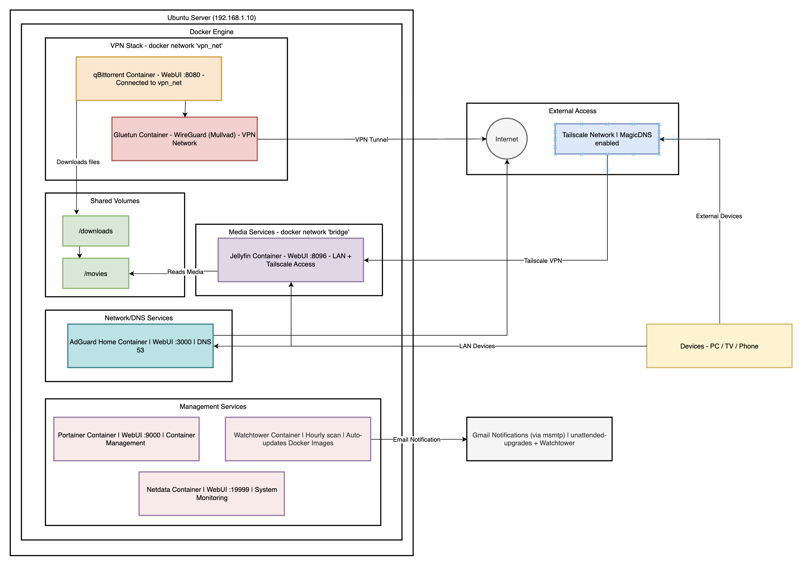
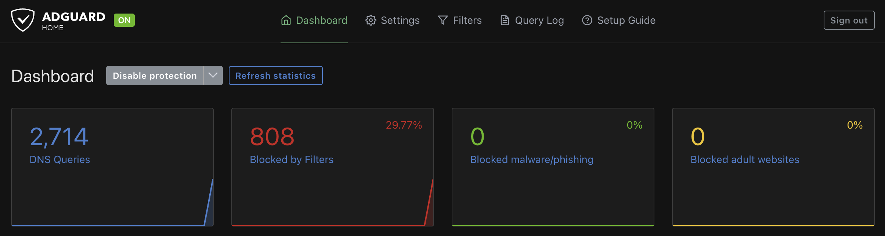

# Homelab: Ubuntu Server with Docker

## The idea

I had an old PC I built back in 2016 sitting unused. Rather than let it gather dust I decided to repurpose it as a home server. The goal was practical: learn Linux properly, get hands-on with Docker outside of a GUI, and run some useful services at home. It turned out to be one of the most useful things I’ve done for my technical development.

-----

## Hardware

A self-built PC from 2016, repurposed as a headless Ubuntu Server. Running 24/7 on the home network at 192.168.1.10. Three PWM case fans (two intake, one exhaust) and a PWM CPU fan are configured via BIOS to ramp up with CPU temperature. At idle the CPU sits at 30 degrees or below.

-----

## What’s running

|Container        |Purpose                       |Port     |
|-----------------|------------------------------|---------|
|qBittorrent      |Download client               |8080     |
|Gluetun          |WireGuard VPN tunnel (Mullvad)|-        |
|Jellyfin         |Media server                  |8096     |
|AdGuard Home     |Network-wide DNS ad blocking  |3000 / 53|
|Tailscale        |Remote access                 |-        |
|Netdata          |System monitoring             |19999    |
|Portainer        |Container management UI       |9000     |
|Watchtower       |Automated container updates   |-        |
|Duplicati        |Automated backups to OneDrive |8200     |
|Minecraft Bedrock|Private game server           |19132 UDP|
|fail2ban         |SSH brute-force protection    |-        |
|Caddy            |Reverse proxy with basic auth |19999    |
|Homepage         |Service dashboard             |3000     |
|Uptime Kuma      |Uptime monitoring + alerts    |3001     |

-----

## Architecture

The setup is split into distinct network stacks, which was a deliberate decision to keep services isolated from each other.

The download client runs inside a dedicated Docker network called vpn_net, alongside the Gluetun container which handles the WireGuard VPN tunnel. Any traffic from the download client is forced through Gluetun before it reaches the internet. If the VPN drops, the traffic stops. This is sometimes called a kill switch pattern and it was one of the trickier parts of the setup to get right.

Jellyfin runs on the standard bridge network and reads media from a shared volume at /movies, which the download client writes to at /downloads. The two containers never talk directly to each other but share the filesystem, which keeps things clean.

AdGuard Home handles DNS for the entire network, blocking ads and trackers at the DNS level before they reach any device. The Tenda MX12 router is pointed at 192.168.1.10 as primary DNS with 1.1.1.1 as a fallback in case the server is offline.

Tailscale provides remote access, allowing me to connect back into the home network securely when away. In practice I use this to run updates and manage containers remotely, and to access Jellyfin when I’m not at home.

Netdata and Portainer sit on top of everything as management tools. Netdata gives real-time visibility into system health and resource usage. Portainer provides a web UI for managing all the containers without needing to SSH in every time.

Watchtower runs on a one hour scan cycle and automatically updates any containers where a newer image is available, keeping the stack current without manual intervention.

Duplicati runs daily at 22:00 and backs up container config folders to personal OneDrive with a 14 day retention policy.

Docker Compose files for each service are documented in their own subfolders within this section of the repository, with sensitive values replaced by placeholders.



-----

## How it came together

The initial server setup and core containers took around five and a half hours. Getting the VPN routing working came about a week later and took another two hours on top of that.

I came into this having only used Docker through a GUI previously. Doing everything in Linux via the command line was a step up. The Gluetun container in particular took a lot of attempts to get right. Getting the networking configured so that the download client’s traffic was actually routing through the VPN rather than around it wasn’t obvious and required a fair bit of troubleshooting. AI helped me work through the configuration once I understood what I was actually trying to achieve.

-----

## Improvements and updates

### Tailscale Magic DNS

After getting Tailscale working for remote access I looked into making it easier to reach services without having to remember IP addresses and port combinations. One option was to buy a domain name and set up DNS records pointing to each service, something like jellyfin.mchomeserver.com. But a free option already existed within Tailscale itself.

Enabling Magic DNS in the Tailscale settings automatically assigns a DNS name to each device on the Tailscale network based on the device name. So instead of connecting to 192.168.1.10:8096 for Jellyfin, I can now use mchomeserver:8096 which is much more practical, especially when accessing multiple services remotely.

### DNS resolution issue after enabling Magic DNS

After enabling Magic DNS, running sudo apt update on the server produced a series of warnings and package updates failed. Pinging 8.8.8.8 by IP worked fine, but pinging google.com by hostname failed. This pointed to a DNS resolution problem rather than a network connectivity issue.

The cause was that Magic DNS had taken over all DNS queries on the server and was routing them through Tailscale’s resolver at 100.100.100.100. When Tailscale couldn’t resolve an external hostname it had no fallback to reach public DNS servers.

The fix was to add global nameservers in the Tailscale DNS settings alongside Magic DNS. DNS queries now go to Tailscale’s 100.100.100.100 first, with Google (8.8.8.8) and Cloudflare (1.1.1.1) as fallbacks. Package updates and general internet connectivity from the server have worked correctly since.

### Automated OS updates with unattended-upgrades

Configured unattended-upgrades on Ubuntu to automatically apply security and package updates daily. Manual reboots are handled separately and done periodically when convenient rather than automatically, to avoid unexpected downtime.

When updates are applied an email notification is sent via msmtp using a Gmail account. This means I get confirmation of what was updated without having to log in and check manually.

### Automated container updates with Watchtower

Watchtower is a container that monitors all other running containers and automatically pulls and applies updated images when they become available. It runs on a one hour scan cycle.

Like unattended-upgrades, Watchtower sends an email notification via msmtp and Gmail whenever a container image is updated. Both notification systems were tested and confirmed working before being left to run.

The combination of unattended-upgrades and Watchtower means both the underlying OS and the container stack stay current automatically. The email notifications provide visibility without requiring manual checks.

### Watchtower scanning fix

About a week after setting up Watchtower, checking the logs revealed it was running scans every hour as expected but reporting `Scanned=0` each time. The logs showed it was running with both label filtering and a scope restriction:

```
Only checking containers using enable label, in scope "mike"
```

The containers had the enable label set correctly:

```
com.centurylinklabs.watchtower.enable=true
```

But they were missing the required scope label:

```
com.centurylinklabs.watchtower.scope=mike
```

Because the scope label was absent, Watchtower ignored all containers entirely despite the enable label being present.

The fix was to remove the scope restriction (`--scope mike`) from the Watchtower configuration so it filters by the enable label only. A manual scan was then triggered to verify:

```bash
docker exec watchtower /watchtower --run-once
```

After the change Watchtower successfully scanned all running containers and sent notification emails reporting available updates for Portainer and AdGuard Home, confirming that both container discovery and notifications are working correctly.

### Watchtower API mismatch and fork migration

Around six months after setup, Watchtower started emailing the same error every minute and had to be stopped:

```
Error response from daemon: client version 1.25 is too old.
Minimum supported API version is 1.44, please upgrade your client to a newer version
```

Docker had been upgraded to version 29 by unattended-upgrades, which raised the minimum supported client API to 1.44. The containrrr/watchtower image embeds its own Docker client, and the image had not been rebuilt since November 2023. Pulling `:latest` made no difference, as the upstream project has effectively been abandoned.

The fix was to migrate to a maintained community fork. `nickfedor/watchtower` is the most active continuation, with regular releases and full drop-in compatibility, using the same labels, environment variables and CLI flags. Switching was a one-line change in the compose file, pinning to the 1.17 minor tag so future major bumps do not happen unattended.

After the switch the new container logged `Watchtower 1.17.1 using Docker API v1.52` and an immediate scan picked up an available netdata update (2.10.1 to 2.10.3), confirming both the daemon connection and the SMTP notification path were working end to end.

### Replacing Pi-hole with AdGuard Home

Pi-hole was the original choice for network-wide DNS ad blocking. The web UI was accessible and the container ran without issues, but two problems prevented it from working properly. The password configuration was not saving correctly, and pointing the Tenda MX12 mesh router to use it as the primary DNS server consistently failed. Research suggested AdGuard Home tends to work more reliably with this router, so the decision was made to switch rather than continue troubleshooting.

The AdGuard Home container was up and running in under ten minutes. Initial testing was done by manually changing the DNS settings on an iPhone rather than at the router level, which allowed testing without affecting the rest of the network.

During testing an issue came up where ads were only being blocked when not connected to Tailscale VPN. Disabling the VPN and testing confirmed the blocking worked correctly without it, which pinpointed Tailscale as the cause rather than AdGuard itself. The fix was to add the server IP to the DNS namespace in the Tailscale settings, which meant AdGuard was used as the DNS server regardless of whether Tailscale was active or not. AI helped confirm the fix once the cause had been identified through testing.

With that resolved, the Tenda MX12 router was pointed to 192.168.1.10 as the primary DNS server. This required accessing the router settings through the iPhone app rather than the browser-based interface, which didn’t expose the relevant setting. With the router change in place, all devices on the network now route DNS queries through AdGuard Home automatically.

The impact was visible immediately. Visiting ad-heavy sites like speedtest.net showed noticeably fewer adverts, and the AdGuard dashboard confirmed DNS queries coming through from devices across the network.



### Hardware upgrade: PWM fans and thermal management

The original 2016 hardware had three fans that ran at 100% constantly. This was loud and drawing more power than necessary for a server sitting at low load most of the time.

Three PWM fans were purchased and installed, two at the front as intake and one at the rear as exhaust. The original CPU fan was kept as it was already PWM rated.

Fan curves were configured in Linux using fan control software for the case fans. The CPU fan did not show up when running lm-sensors as the BIOS was managing it directly. Going into the BIOS and changing it from full speed mode to Level 2 out of 9, after testing multiple levels and monitoring CPU temperature under load, resolved this. The server now sits at 30 degrees or below at idle with both fans configured to ramp up as temperature increases.

### Backups to OneDrive with Duplicati

Getting automated backups to OneDrive working took three attempts.

The first attempt used Duplicati but failed at the initial login step as the password setup for the web UI could not be completed.

The second attempt used a containerised restic and rclone solution. This failed due to mounting issues with the rclone config, unreliable runtime installs inside an Alpine-based container, and headless OneDrive authentication requiring an external device. After repeated troubleshooting it was reverted.

The third attempt returned to Duplicati with a better understanding of what had gone wrong the first time. Several specific issues had to be worked through. The latest stable image (2.1.x) dropped the consumer OneDrive backend so the development tag was used instead. Getting into the web UI required setting `DUPLICATI__WEBSERVICE_ALLOWED_HOSTNAMES=*` to allow connections from the server IP. The container also required `SETTINGS_ENCRYPTION_KEY` to start. On first run with a fresh config volume there is no password, so the login workaround was using the literal string `no-password` and then setting a proper password in settings afterwards. A permissions issue on Portainer’s data directory required a chmod fix as it was root owned. Two AdGuard runtime database files throw locked file warnings during backup which are harmless and can be ignored.

Backup runs daily at 22:00, targeting specific container config folders and excluding media files from the qBittorrent downloads folder. Backups go to `Documents/Personal/Backup/Homelab/` on personal OneDrive with a 14 day retention policy.

### Adding fail2ban for SSH brute-force protection

The home network is trusted and the router does not forward port 22, but adding a second layer of brute-force protection at the host level is a sensible practice on any internet-connected machine and pairs naturally with the existing UFW configuration. fail2ban reads the auth log, counts failed attempts per source IP and inserts temporary iptables rules to reject further connections once a threshold is crossed.

fail2ban was set up as a containerised service to match the rest of the stack, using `lscr.io/linuxserver/fail2ban`. The container needs `network_mode: host` and `NET_ADMIN`/`NET_RAW` capabilities so the rules it inserts land in the host's iptables and not just the container's own namespace. The host's `/var/log` directory is mounted read-only so the container can tail `auth.log` without being able to modify it.

The only custom configuration is a single `jail.local` file that overrides the defaults: ban for one hour after five failures within ten minutes, and never ban anything in `127.0.0.1/8`, `::1`, `192.168.1.0/24` or `100.64.0.0/10`. The last range is Tailscale's CGNAT space, which keeps every Tailscale peer out of any possible ban list. Only the sshd jail is enabled. The image ships with templates for many other services but they all default to disabled.

A test ban against `203.0.113.99` (a documentation-only IP from TEST-NET-3) confirmed that the `f2b-sshd` chain was created in the host's iptables and the jump from `INPUT` was inserted on TCP port 22. `fail2ban-regex` was then run against the live `auth.log` to confirm the filter parses the ISO-8601 timestamp format produced by rsyslog on Ubuntu 24.04. fail2ban coexists with UFW because each tool maintains its own chains and inserts its own jumps; they do not overlap or interfere.

One quirk specific to this image: `fail2ban-client reload` does not fully reapply changes and can leave a jail with no action attached. Restarting the container with `docker compose restart` is the reliable way to apply config edits.

### Tightening UFW for SSH and Jellyfin

A review of the running UFW rules showed that SSH and Jellyfin had been added with `ufw allow 22/tcp` and `ufw allow 8096`, permitting traffic from any source. Other services (Portainer, Duplicati, AdGuard's admin pages) had no UFW rules at all and relied on the default-deny policy to stay locally reachable only. The wildcard entries were inconsistent with the rest of the policy and left the firewall more open than the LAN-plus-Tailscale trust model required.

The fix was to add explicit allow rules for both ports from `192.168.1.0/24` and `100.64.0.0/10`, then delete the wildcards. With default-deny still in place, no explicit deny rules are needed. A second SSH session was kept open as a safety net during the change, and the new policy was verified from the LAN and from a phone connected via Tailscale with Wi-Fi disabled.

### Moving service secrets out of compose files

Three docker-compose files held secrets in plaintext at world-readable file mode: the Duplicati web UI password and database encryption key, the Watchtower Gmail SMTP password, and the qBittorrent stack's Mullvad WireGuard private key. The repository already had `.env` in `.gitignore`, but the live compose files on the server were not following that pattern.

The fix was to extract each secret into a `.env` file alongside its compose file, set mode `0600` on each, and replace the inline values with `${VARIABLE}` substitutions in the compose. While doing this the Duplicati web UI password was rotated from the weak default to a long random value, and the `SETTINGS_ENCRYPTION_KEY` was preserved exactly as-is so the existing Duplicati config database remained decryptable. Watchtower was force-recreated to confirm the env var was being read correctly, and Duplicati was tested with the new password via the web UI.

The compose files are now safe to commit publicly. The `.env` pattern is the standard going forward for any new service with credentials.

### Putting Netdata behind authentication

The Netdata web UI had been reachable without authentication. UFW restricted external access to LAN and Tailscale only, but any client on either network could read full system metrics and the Netdata Cloud claim ID without credentials. The fix was to add a small reverse proxy in front.

A Caddy container was added in `~/caddy/` with `network_mode: host`. Its Caddyfile listens on port 19999 with HTTP basic auth and proxies authenticated requests to `localhost:19998`. The Netdata compose was updated to bind to `127.0.0.1:19998:19999` so the dashboard is no longer reachable from outside the host's loopback interface. The bcrypt password hash sits in a `.env` file at mode `0600`, referenced as `${BASIC_AUTH_HASH}` so no secret lands in the compose. Verification was done with curl from the host (401 without credentials, 401 with wrong credentials, refused for direct hits to the Netdata port) and from a browser on both the LAN and via Tailscale.

### Enabling Tailnet Lock

Tailnet Lock was enabled to protect against a Tailscale account takeover. Without lock, anyone with access to the Tailscale account could add an arbitrary device to the tailnet and gain reachability to internal services. With lock enabled, any new device joining the tailnet must be cryptographically signed by an existing trusted node before it can connect, and existing peers are unaffected.

Lock was initialised on the homeserver with `tailscale lock init --gen-disablement-for-support --gen-disablements=2 tlpub:<server-key>`. The first attempt failed because the command requires the current node's tailnet-lock public key to be explicitly listed as a trusted signer rather than added implicitly; passing the key as an argument on the second attempt succeeded. The two disablement secrets were stored in Bitwarden immediately. A third disablement secret was generated for Tailscale support, so even if both local secrets are ever lost there is still a recovery path.

The trade-off is that adding any new device to the tailnet now requires a `tailscale lock sign` step from the server. A small recurring cost for a meaningful reduction in account-takeover blast radius.

### Adding DNSSEC validation to AdGuard

Enabling DNSSEC validation in AdGuard turned out to be a two-step exercise rather than a single toggle. The DNSSEC option in AdGuard's settings was switched on, but a test against `dnssec-failed.org` (a domain published with intentionally broken signatures specifically for this purpose) revealed AdGuard was returning the A record rather than `SERVFAIL`. The cause was the upstream resolver configuration: AdGuard was set to `https://dns10.quad9.net/dns-query`, which is Quad9's variant that explicitly disables DNSSEC validation. AdGuard could set the `DO` bit on outbound queries but had nothing to validate against because Quad9's `dns10` strips DNSSEC records before returning.

The fix was to change the upstream to `https://dns.quad9.net/dns-query`, Quad9's standard secure-with-DNSSEC endpoint. After the change, `dnssec-failed.org` correctly returns `SERVFAIL` while legitimate domains continue to resolve normally. The difference between Quad9 variants is documented on their site but easy to miss when picking an upstream from a list.

### Capping Docker container log sizes

The Docker daemon's default JSON-file log driver does not rotate or cap log file sizes. A noisy or compromised container could fill the host disk with logs indefinitely. A small `/etc/docker/daemon.json` was added setting `max-size: "10m"` and `max-file: "3"` so each container is capped at thirty megabytes of retained logs. Existing containers were force-recreated to inherit the new defaults, so the cap is now consistent across the stack rather than waiting for natural attrition via Watchtower-driven updates.

### Hardening the Docker socket with a proxy

Watchtower previously had read-write access to `/var/run/docker.sock`. A compromise of the Watchtower container, for example via a supply-chain attack on the image, would have meant full Docker API access and effectively host root. A `tecnativa/docker-socket-proxy` container was added in front of Watchtower to restrict the API surface to only what Watchtower actually needs: list and inspect containers, list and inspect images, send POST requests to start and stop containers, watch events, and a few read-only endpoints (info, ping, version). Volumes, exec, networks, secrets and swarm endpoints all stay denied at the proxy.

Verification was done by querying allowed endpoints from within the proxy network and confirming `200`, then querying denied endpoints and confirming `403`. Watchtower itself was verified by running a single-shot scan and confirming all containers were scanned with no failures. Portainer was left with direct socket access because its purpose as a Docker management UI means it needs broad API access anyway; limiting Portainer through a proxy would either break it or leave it almost as permissive as direct access.

### Switching to SSH key authentication

The SSH login flow was hardened from password authentication to public-key authentication. The risk model for the home server had originally accepted password auth because the router did not forward port 22 to the outside world and fail2ban was watching the auth log, but neither protection makes the authentication itself stronger. A compromised LAN device or a router configuration change would have left an unprotected attack surface against the `mike` account.

An ed25519 keypair was generated on the Mac laptop and a separate keypair was generated on the iPhone via Termius, following the principle that each device gets its own key so revocation is per-device. The public keys were appended to `/home/mike/.ssh/authorized_keys` on the server, labelled with the device and date for clarity. Both private keys were backed up to Bitwarden with their passphrases.

The hardening on the server side was done with a new file at `/etc/ssh/sshd_config.d/00-hardening.conf` setting `PasswordAuthentication no`, `PubkeyAuthentication yes`, `KbdInteractiveAuthentication no`, `X11Forwarding no` and explicitly `PermitRootLogin prohibit-password`. The initial attempt used filename `99-hardening.conf` but the effective `PasswordAuthentication` remained `yes`. The cause was Ubuntu's `50-cloud-init.conf`, which sets `PasswordAuthentication yes` and is read before our override; OpenSSH uses first-match-wins for directives, so the cloud-init value was winning. Renaming the file to `00-hardening.conf` so it sorts first resolved this. After `sshd -t` validation and a graceful `systemctl reload ssh`, password authentication was confirmed to be rejected while key authentication continued to work from both Mac and iPhone. The whole change was performed with a second SSH session kept open as a safety net.

### Adding Homepage as a service dashboard

After the homelab had accumulated nine containers across different ports and four web UIs at different paths, navigating to the right URL by memory had become tedious. Homepage was added as a single landing page at `http://mchomeserver:3000/` that lists every service with its description, status indicator and a one-click access link, alongside live data widgets and a local weather panel.

The container is `ghcr.io/gethomepage/homepage:latest`. It reads YAML config files in `~/homepage/config/` for services, widgets, bookmarks and global settings. Live container status comes from a read-only mount of `/var/run/docker.sock`. Widget integrations were added for AdGuard (queries and block stats), Jellyfin (library counts), Portainer (running containers) and Watchtower (scan and update counts). The Watchtower integration required enabling that container's HTTP metrics API and attaching Homepage to Watchtower's internal `docker-proxy` network so the metrics endpoint never has to be exposed on the host. All credentials and API keys live in a `.env` file at mode `0600`, referenced from the YAML config via `${HOMEPAGE_VAR_*}` substitution, matching the rest of the stack's secrets pattern.

The container runs as root inside its namespace because Homepage's docker integration requires socket access that PUID-style privilege dropping does not carry through cleanly. Container namespace isolation makes this acceptable: it is "root inside the container", not host root.

### Adding Uptime Kuma for service availability alerting

Netdata gives deep performance metrics but does not actively alert when a service stops responding. Uptime Kuma fills that gap. It probes each service on a 60-second interval and sends an email when any monitor goes down. Together the two tools cover both observability (Netdata) and proactive alerting (Uptime Kuma).

The container is `louislam/uptime-kuma:1`. It started in bridge mode but had to be moved to `network_mode: host` because some target services (Jellyfin, SSH and Minecraft) use host networking, so UFW filters connections to them as host-bound traffic. From a Docker bridge, Uptime Kuma's source IP did not match the existing LAN or Tailscale allow rules and UFW dropped the probes. In host network mode, Uptime Kuma's probes originate from the host and pass UFW cleanly. Services using Docker port-mapping (AdGuard, Duplicati, Portainer, Homepage) worked from either mode because Docker's NAT path bypasses UFW.

Monitors were added for every running service plus a public-internet ping and a Tailscale self-ping. The Netdata monitor accepts HTTP `401` rather than `200-299`, because the Caddy basic-auth challenge is itself proof that the proxy chain is alive. Email notifications use a dedicated Gmail app password labelled `uptime-kuma`, kept separate from the existing Watchtower and unattended-upgrades app passwords so each can be revoked independently.

### Ansible for stack deployment (Phase 1)

Adding `homelab/ansible/` brings the Docker stack under host-as-code management. The first phase scope is deliberately narrow: bringing every service from a fresh checkout of this repo to its running state on the homeserver. Installing Docker itself, configuring UFW, msmtp, sshd hardening, and the rest of the host configuration is reserved for later phases.

The playbook is invoked from a containerised Ansible to avoid installing it on the host. A small `Dockerfile` builds an image on top of `cytopia/ansible:latest-tools` that adds the Docker CLI, the compose plugin and rsync. The wrapper script `run.sh` builds this image on first use, then runs the playbook with the repo, the runtime home directory, and `/var/run/docker.sock` mounted in. The playbook itself targets `localhost` with `connection: local`, so no SSH-to-self is required.

For each service the playbook ensures the runtime directory exists, rsyncs the docker-compose file and any non-secret config from the repo (always excluding `.env` so real secrets on the host are never overwritten), then brings the service up with `docker compose up -d` if a real `.env` is present (or none is required). Services that want to start but lack an `.env` are reported at the end of the run with a clear next-step message.

A dry run with `bash run.sh --check --diff` validates the playbook without touching the box. Idempotency is the design goal: re-running after a successful run should be a no-op aside from any Watchtower image-update bumps.

-----

### Binding management UIs to loopback and Tailscale only

Homepage, Open WebUI, Duplicati and Portainer had all been published on `0.0.0.0`, reachable from anywhere on the LAN even though the trust model for the rest of the stack assumed Tailscale's own iptables rules — which bypass UFW entirely — were the only path in for services like these. Duplicati in particular can read `/etc` and all of `/home/mike`, and Portainer holds a full read-write Docker socket, so both were more exposed on the LAN than intended. A review on 2026-07-06 rebound all four to `127.0.0.1` plus the box's Tailscale address, so nothing is listening on the LAN-facing interface at all any more. Portainer's plaintext `:9000` HTTP port was retired at the same time in favour of its built-in HTTPS listener on `:9443`.

The Tailscale address was hardcoded into all four compose files at first. See "Automating the Tailscale IP across tailnet-bound services" further down for why that didn't stay hardcoded for long.

### Replacing Homepage's Docker socket access with a scoped proxy

Homepage's docker widget needs to read container status, and the straightforward way to give it that is mounting `/var/run/docker.sock` read-only into the container. That was the original setup, and it worked, but a compromise of Homepage — a dashboard pulling in a fair amount of third-party widget code — would then have had a full list/inspect view of the host's entire Docker daemon. Watchtower already had this exact problem solved with a `tecnativa/docker-socket-proxy` sidecar scoped to only the endpoints it needs, so the same pattern was applied to Homepage: a second, independently-scoped `homepage-dockerproxy` container permitting only `CONTAINERS`, `INFO`, `VERSION` and `PING`, with exec, volumes, secrets, images and networks all denied. Homepage now reaches it at `http://homepage-dockerproxy:2375` instead of the raw socket, and the socket mount was removed from Homepage's own compose entry entirely.

While making that change, Homepage was also switched to run as a non-root user (`1000:1000`) rather than root-inside-the-container. Dropping the socket mount removed the only reason it needed root in the first place, since `./config` is already owned by `mike` (uid 1000).

### Dropping Netdata's SYS_PTRACE capability and unconfined AppArmor profile

Netdata's compose file carried `cap_add: [SYS_PTRACE]` and `security_opt: [apparmor=unconfined]`, both there to let its `apps.plugin` component read per-process resource usage from `/proc` for processes outside its own container namespace. In practice Netdata's per-process charts kept working fine under the default `docker-default` AppArmor profile with neither setting, so both were dropped to shrink what a compromised Netdata container could do — `SYS_PTRACE` in particular makes process injection meaningfully easier. The container's existing read-only mount of `/var/run/docker.sock` was left as it was. If the per-process memory charts are ever found to be missing data, the capability (not the AppArmor override) is the one to try re-adding first — it's left commented out in place in the compose file for exactly that.

### Raising AdGuard's memory limit

AdGuard's `mem_limit` was raised from 1g to 2g. This wasn't a response to AdGuard actually hitting the old ceiling — it was a precautionary bump, made because the box has memory to spare and there's no upside to leaving AdGuard, the one service every device on the LAN depends on for DNS, running that close to a limit for no real reason.

A separate, not-yet-applied change is noted directly in the compose file: switching to `network_mode: host` would let AdGuard assign clients stable IDs by MAC address (reading the ARP table) instead of by IP, which would be more reliable on a LAN with DHCP leases that occasionally rotate. It's blocked on UFW ordering: Docker's published-port DNAT for `:53`/`:80` currently bypasses UFW's filtering, but host networking would not, and turning it on today would cut LAN clients off from DNS entirely until UFW explicitly allows 53/80 from `192.168.1.0/24` first.

### Upgrading Uptime Kuma from v1 to v2

Upgraded `louislam/uptime-kuma` from the `:1` tag to `:2`. The v1→v2 jump runs a one-way database migration on first boot — there's no supported downgrade path once it's run — so a full copy of the pre-upgrade data directory was taken first (`kuma-data-backup-v1.23.17-*.tar.gz`, kept alongside the live data directory) before pulling the new image and letting it migrate.

### Removing Minecraft from Watchtower's scope

Minecraft's `com.centurylinklabs.watchtower.enable` label was flipped from `true` to `false`. The itzg Bedrock image already updates itself: `AUTO_UPDATE=true` bumps the Bedrock server binary in place inside the container on every restart, writing a pre-upgrade snapshot to `/data/backup-pre-<version>/` first for rollback safety (see the Minecraft section below). Watchtower recreating the container from a new image on top of that doesn't add anything, since the image tag was never pinned to a Bedrock version in the first place — a Watchtower-triggered recreate was just an extra container restart, with the restart risk that carries for whoever's mid-session, for no update it wasn't already getting from `AUTO_UPDATE` on its own.

### Watchtower took down its own socket proxy

At 10:03 on 2026-07-27, Watchtower's hourly scan found an available update for its own `socket-proxy` sidecar and did what it always does: stopped the old container and recreated it from the new image. The problem is that Watchtower reaches the Docker API *through* socket-proxy (`DOCKER_HOST=tcp://socket-proxy:2375`) — stopping socket-proxy mid-scan severed the connection Watchtower needed to bring anything back up again. socket-proxy, Homepage's separate `homepage-dockerproxy` (same image, also matched by Watchtower's default "anything with the enable label" behaviour) and Open WebUI all went down and stayed down until manually restarted.

The fix was to add `com.centurylinklabs.watchtower.enable=false` to socket-proxy specifically, with a comment in the compose file spelling out why so a future update doesn't quietly re-enable it: that image now gets updated by hand (`docker compose pull socket-proxy && docker compose up -d`). Everything else Watchtower manages continues to update automatically; only the container it depends on to do so is excluded.

### Automating the Tailscale IP across tailnet-bound services

Homepage, Open WebUI, Duplicati and Portainer all bind to the box's Tailscale address as well as loopback (see "Binding management UIs to loopback and Tailscale only" above). That address had been hardcoded into all four compose files, which meant any change to it — a re-registration, moving networks, anything that hands the box a new Tailscale IP — would leave all four containers unable to bind, with no alert and no obvious symptom beyond `docker ps` still showing them as healthy despite nothing actually being published.

`homelab/scripts/sync-tailnet-ip.sh` fixes this by running from cron (`@reboot` and every 15 minutes) and treating the live `tailscale ip -4` output as the source of truth. It writes the current address into each project's `.env` as `TAILNET_IP` (which the compose files interpolate) and only touches a project if something's actually drifted: the `.env` value is stale, the container isn't running, or the container is running but Docker reports no published ports for it at all — the specific failure mode this script exists to catch, since a healthy-looking `docker ps` entry doesn't guarantee anything is actually reachable. A sanity check refuses to apply any address outside Tailscale's CGNAT range (`100.64.0.0/10`), so a bug that reads garbage instead of an IP fails loudly instead of quietly recreating four containers with a bad bind address.

-----

## What I learned

Running Docker properly in Linux is meaningfully different from using it through a GUI. Writing and editing docker-compose files directly, understanding how container networking actually works, and debugging why a container won’t start are all skills that don’t translate from clicking around a UI.

The VPN routing setup gave me a real understanding of Docker network isolation. The whole point of vpn_net is that containers on it can only reach the outside world through Gluetun. If that container goes down, the others on that network lose internet access entirely. Understanding why that works requires understanding how Docker handles routing between networks, which is directly applicable to the AWS networking concepts I’m covering in the SAA course.

The Magic DNS issue and the AdGuard/Tailscale conflict were both good examples of how changes in one part of a system can have unexpected effects elsewhere. In both cases the diagnostic approach was the same: isolate the variable, test with it removed, and confirm the theory before applying a fix. That approach works whether you’re troubleshooting a home server or a production environment.

Tailscale is genuinely impressive for remote access. It uses a mesh VPN approach where devices connect directly to each other rather than through a central server. Setting it up took about ten minutes and it just works. Magic DNS builds on top of that to make day to day use much more practical.

-----

### Minecraft Bedrock Server

Set up a private Minecraft Bedrock server for a family member using the itzg/minecraft-bedrock-server Docker image. The server runs on UDP port 19132 and is not exposed to the public internet at all. Access is restricted entirely through Tailscale.

The interesting part of this setup is the Tailscale ACL configuration. Rather than giving the external player full access to the Tailscale network, a specific ACL policy was created that restricts their account to only the Minecraft service. They cannot see or reach any other devices or services on the network. This is a practical example of least privilege applied to network access, the same principle that underpins IAM in AWS.

UFW firewall rules were also added to ensure the Minecraft port is only reachable via the Tailscale subnet, adding a second layer of access control.

The bedrock image does not provide scheduled world backups (the `ENABLE_BACKUPS`, `BACKUP_INTERVAL` and `BACKUP_KEEP` environment variables belong to the Java-edition image, not bedrock). Pre-upgrade snapshots are still created in `/data/backup-pre-<version>/` when `AUTO_UPDATE` bumps the Bedrock version, providing rollback safety against bad releases. Scheduled world backups are handled separately by Duplicati, which picks up the world files from the mounted `/data` volume as part of the daily 22:00 job. Watchtower labels were originally included so container image updates were handled automatically; see "Removing Minecraft from Watchtower's scope" above for why that label was later switched off.

-----

## What’s next

- Update architecture diagram to include Duplicati, Minecraft, fail2ban, Caddy, Homepage, Uptime Kuma, Ollama and Open WebUI — the diagram currently only shows qBittorrent, Gluetun, Jellyfin, AdGuard Home, Tailscale, Portainer, Watchtower and Netdata
- Upgrade to Ubuntu 26.04.1 once available (expected end of August 2026)
- Allow LAN access to 53/80 in UFW, then switch AdGuard to `network_mode: host` for MAC-based client IDs (see "Raising AdGuard's memory limit" above)
- Manually remove the now-unused UFW allow rules for Homepage (3000) and Open WebUI (3002) on the host (`sudo ufw status numbered` then `sudo ufw delete <n>`) — the Ansible role only adds rules from `ufw_rules`, it never retracts ones removed from the list, so these two are still live on mchomeserver even though the source of truth no longer lists them
- Bring `homelab/scripts/sync-tailnet-ip.sh` under Ansible management instead of installing it by hand

-----

## Skills this covers

Linux server administration, Docker, container networking, VPN configuration, network access control, DNS troubleshooting, remote access, system monitoring, automated patching, cloud backups, infrastructure observability, and systematic fault isolation. Most of these map directly onto the containerisation, networking, and operational topics coming up in the AWS portion of my learning.